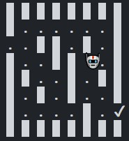

# Agent navigation in a maze using TD Reinforcement Learning

This is the second homework done for the course of Automated Decision Making (2021-2022) at the University of Modena and Reggio Emilia.
It consists of a Python script that executes a RL algorithm (Temporal Difference/Q-Learning) that trains an agent inside a labyrinth to find the exit with the least number of steps possible.

## Setup
The default maze for the agent to escape is the following (image)

### Considerations
- At each step the agent occupies one of the white squares.
- At each step the agent has 4 possible actions: up, down, left,
right.
- The status is the current position (square)
- The reward is -1 if the action is feasible (remind that we want
to minimize the total length of the path), while it is -30 if the
action is infeasible (moves toward a black square)
- The training is made using the one step temporal difference
learning : TD(0) to learn the q(s, a) function
- The learned q() is used for the tests.
The maze can be represented with a binary matrix where 1 denotes
a black square and 0 a white one.

### The TD(0) or Q-Learning algorithm (pseudocode)

## SCRIPT & ALGORITHM DESCRIPTION

In the main script, two classes are present: the **Environment** class and the **TDAgent** class. Those two classes are used
in the **main()** function to allow the TD Reinforcement Learning algorithm to take place. The **main()** function takes the
following parameters (of which, part of them are used by the two classes):

- **num episodes**: number of episodes for updating the policy.
- **α**: weight given to the TD error, to update the policy online.
- **γ**: discounting factor for the future state-action reward.
- **ε**: probability (normalized by 100) of making a random action in the training using the ε-greedy approach.
- **import_maze_csv**: when True, imports an example maze from a .csv file.
- **show_training**: when True, shows the training steps that the agent make, for every episode till the end of all the
episodes. It is useful to visualize the improvement of the agent between the episodes.

## Training

After the instantiation of the Environment and TDAgent objects, a training phase is started.
First the policy **Q(S,A)** is initialized with random values, then a **for loop cycles each episode** e where at the start of
them the state of the agent is set to the initial one S0.

The following **pseudocode loop (for each episode)** is implemented:
1. Given the state **S**, select an action **A** using a ε-greedy policy **Qε(S,A)**.
2. Given the selected action A, perform the action in the environment and compute the reward R, the next state **S′**
and the **”is_over”** flag (to understand if the agent has reached the exit of the maze).
3. Update the policy matrix using the ***TD(0)*** update:
   
   **Q(S,A) ← Q(S,A) + α[R + γ maxa Q(S′,a) −Q(S,A)]**
4. Repeat until the episode terminates (agent reaches the maze exit)

## Testing and Results
***The agent is able to autonomously travel from start to finish in the least amount of moves thanks to the learned greedy policy.***

At the end of the training, to show the results, a version of the maze with the learned policy is printed. 
After pressing
ENTER, a small simulation is executed to show how the agents follows the learned policy to reach the end of the maze. 
A simple loop where only the greedy policy Q(S,A) is used for this purpose.

The algorithm was also tested with a custom
maze from the labyrint.csv file. 

The images below show the maze used, the agent in action and the learned policy.

  

## Important Notes
More comments and explanations are present in the H2_CANDELORO_python.py script.
Also all the readme was originally wrote in the H2_CANDELORO_description.pdf

The following code was adapted
and reformatted from a previous exercise done for the course of Machine Learning and Deep Learning (2020-2021) at the
University of Modena and Reggio Emilia.

The original project and code can be found at [this link](https://drive.google.com/drive/folders/1btN4CHqwsDtXdGXHTj7CMlHoKsS7ob2Z?usp=sharing).

All credits for the snippet of code used goes to the original author(s).

